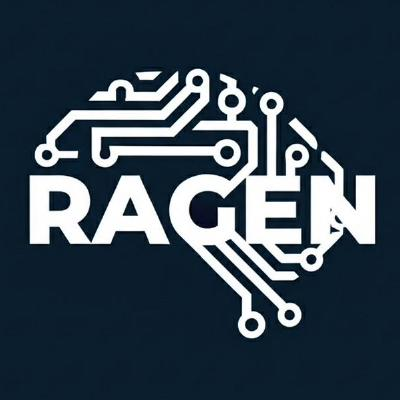

<h1 align="center"> RAGEN: Training Agents by Reinforcing Reasoning </h1>

<p align="center"></p>

<p align="center">
 Flexible, and stable RL training for reasoning LLM agents
</p>

<p align="center">
  <!-- TODO: replace XXXX.XXXXX with actual v2 arXiv ID once available -->
  <a href="https://arxiv.org/abs/XXXX.XXXXX"></a>
  <a href="https://arxiv.org/abs/2504.20073"></a>
  <a href="https://ragen-ai.github.io/"></a>
  <a href="https://ragen-doc.readthedocs.io/"></a>
  <a href="https://x.com/wzihanw/status/1915052871474712858"></a>
  <a href="https://api.wandb.ai/links/zihanwang-ai-northwestern-university/a8er8l7b"></a>
</p>

## About

RAGEN is a flexible and stable open-source framework for training reasoning LLM agents via reinforcement learning in interactive, multi-turn, stochastic environments.

RAGEN is **flexible** with:

- **StarPO framework** -- Unified optimization for multi-turn agents, supporting both trajectory-level and turn-wise training
- **10 built-in environments** -- Sokoban, FrozenLake, WebShop, DeepCoder, SearchQA, Lean, Bandit, Countdown, MetaMathQA, Sudoku
- **Gym-compatible interface** -- Easy to add custom environments

RAGEN is **stable** with:

- **SNR-Adaptive Filtering (v2)** -- Lightweight rollout filtering based on reward variance to mitigate noisy gradient updates
- **Reasoning collapse diagnostics (v2)** -- MI proxy metrics to detect and monitor template collapse during training

## Update Log

**2026.3.12 -- RAGEN v2 released 🔥.** A systematic study of reasoning collapse in agent RL and lightweight interventions to enable stable training. See [v2 paper](https://arxiv.org/abs/XXXX.XXXXX). <!-- TODO: update arXiv link -->

<details>
<summary>Older updates</summary>

**2025.5.8** -- Official [Documentation](https://ragen-doc.readthedocs.io/) released.

**2025.4.20** -- RAGEN [paper](https://arxiv.org/abs/2504.20073) released. Codebase restructured with veRL as submodule; modular architecture (ES Manager, Context Manager, Agent Proxy).

**2025.1.27** -- Initial RAGEN release. [Post](https://x.com/wzihanw/status/1884092805598826609).

</details>

## Getting Started

```bash
git clone https://github.com/mll-lab-nu/RAGEN.git
cd RAGEN
conda create -n ragen python=3.12 -y && conda activate ragen
bash scripts/setup_ragen.sh
```

Use `bash scripts/setup_ragen.sh --with-search` to include the search environment. For WebShop, see [docs/experiment_webshop_release.md](docs/experiment_webshop_release.md).

**Train (no filter, default):**
```bash
python train.py --config-name _2_sokoban
```

**Train with SNR-Adaptive Filtering (Top-p):**
```bash
python train.py --config-name _2_sokoban \
  actor_rollout_ref.rollout_filter_strategy=top_p \
  actor_rollout_ref.rollout.rollout_filter_value=0.9
```

SNR-Adaptive Filtering consistently improves training across algorithms, model scales, and modalities (green = gain from filtering):

<p align="center"></p>

See the [Rollout Filtering Guide](docs/guide_rollout_filtering.md) for more filtering strategies (Top-k, linear mode, etc.).


## Documentation

- [Full Documentation](https://ragen-doc.readthedocs.io/)
- [Rollout Filtering Guide](docs/guide_rollout_filtering.md)
- [MI Metrics Reference](docs/reference_mutual_information_metrics.md)
- Adding Custom Environments -- Gym-compatible interface, see `config/envs.yaml` and [documentation](https://ragen-doc.readthedocs.io/)
- Experiment reproduction: [Main Table](docs/experiment_main_table.md) | [Intervention Sweep](docs/experiment_intervention_sweep.md) | [FrozenLake](docs/experiment_frozen_lake_slipper_sweep.md) | [Sokoban Gradient](docs/experiment_sokoban_gradient_analysis.md) | [Search](docs/experiment_search.md) | [DeepCoder](docs/experiment_deepcoder.md) | [WebShop](docs/experiment_webshop_release.md)

## Awesome Work Powered or Inspired by RAGEN

- [ROLL](https://github.com/alibaba/ROLL): Efficient Scaling Library for RL with LLMs
- [VAGEN](https://github.com/RAGEN-AI/VAGEN): Training Visual Agents with multi-turn RL
- [Search-R1](https://github.com/PeterGriffinJin/Search-R1): Train LLMs to reason and call a search engine with RL
- [ZeroSearch](https://github.com/Alibaba-nlp/ZeroSearch): Incentivize LLM Search Capability without Searching
- [Agent-R1](https://github.com/0russwest0/Agent-R1): Training Powerful LLM Agents with End-to-End RL
- [OpenManus-RL](https://github.com/OpenManus/OpenManus-RL): RL tuning for LLM agents
- [MetaSpatial](https://github.com/PzySeere/MetaSpatial): Reinforcing 3D Spatial Reasoning in VLMs
- [s3](https://github.com/pat-jj/s3): Efficient Yet Effective Search Agent Training via RL

## Citation

```bibtex
@misc{ragen-v2,
      title={Understanding Reasoning Collapse in LLM Agent Reinforcement Learning},
      author={Zihan Wang and Chi Gui and Xing Jin and Qineng Wang and Licheng Liu and Kangrui Wang and Shiqi Chen and Linjie Li and Zhengyuan Yang and Pingyue Zhang and Yiping Lu and Jiajun Wu and Li Fei-Fei and Lijuan Wang and Yejin Choi and Manling Li},
      year={2026},
      eprint={XXXX.XXXXX},
      archivePrefix={arXiv},
      primaryClass={cs.LG},
      url={https://arxiv.org/abs/XXXX.XXXXX},
}
```

```bibtex
@misc{ragen,
      title={RAGEN: Understanding Self-Evolution in LLM Agents via Multi-Turn Reinforcement Learning},
      author={Zihan Wang and Kangrui Wang and Qineng Wang and Pingyue Zhang and Linjie Li and Zhengyuan Yang and Xing Jin and Kefan Yu and Minh Nhat Nguyen and Licheng Liu and Eli Gottlieb and Yiping Lu and Kyunghyun Cho and Jiajun Wu and Li Fei-Fei and Lijuan Wang and Yejin Choi and Manling Li},
      year={2025},
      eprint={2504.20073},
      archivePrefix={arXiv},
      primaryClass={cs.LG},
      url={https://arxiv.org/abs/2504.20073},
}
```
