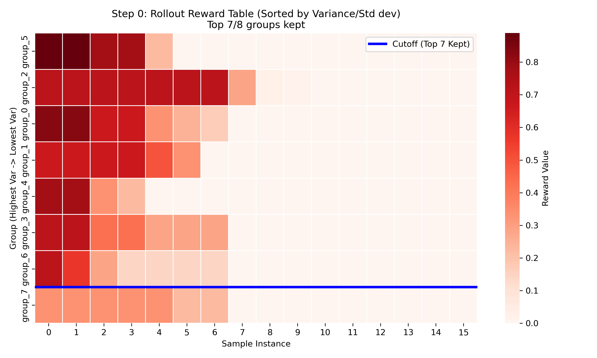
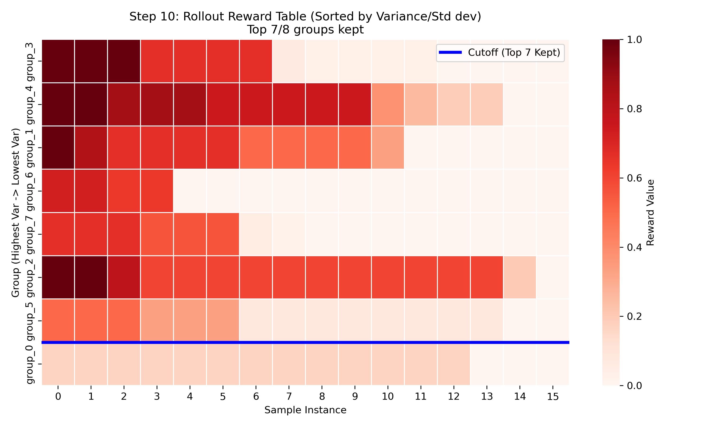
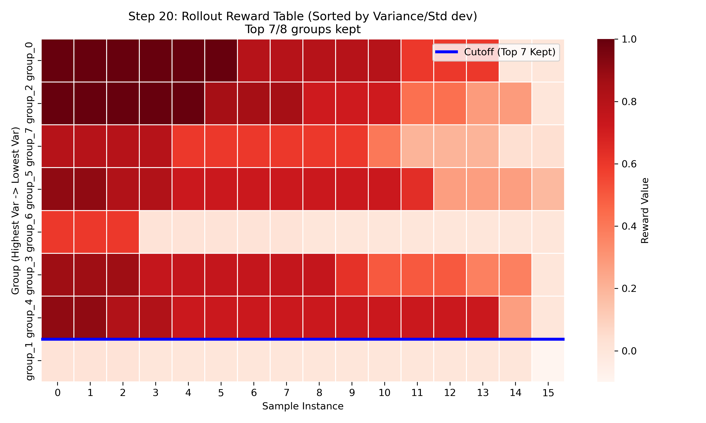
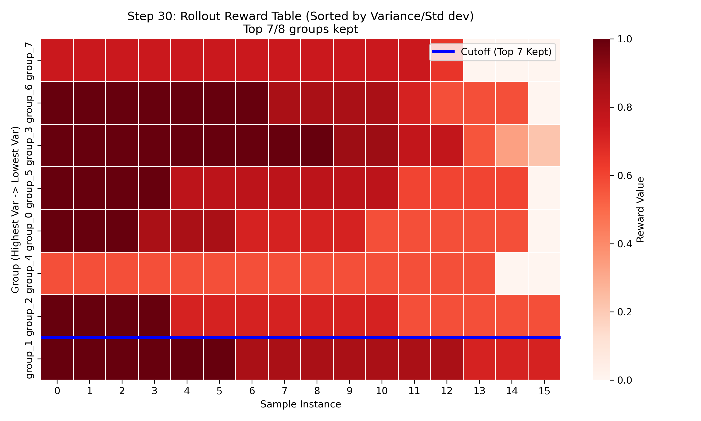
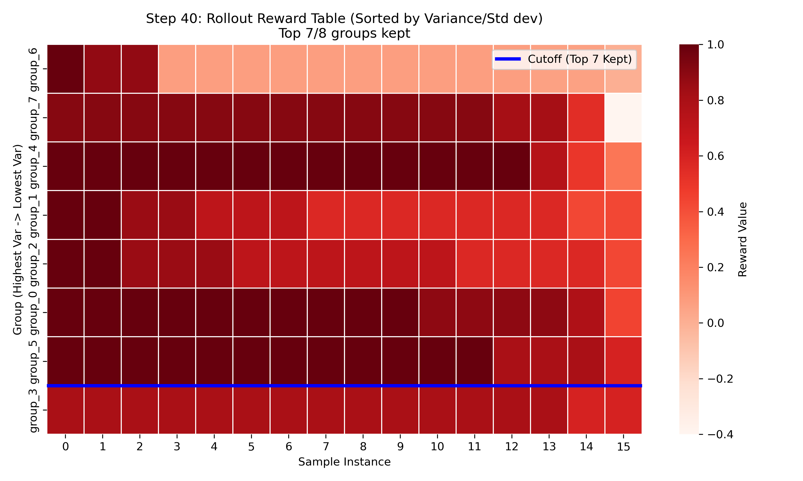
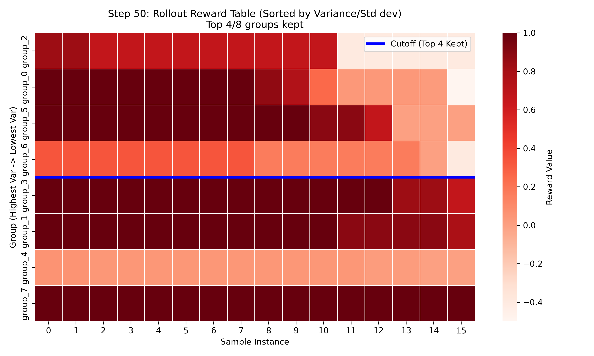
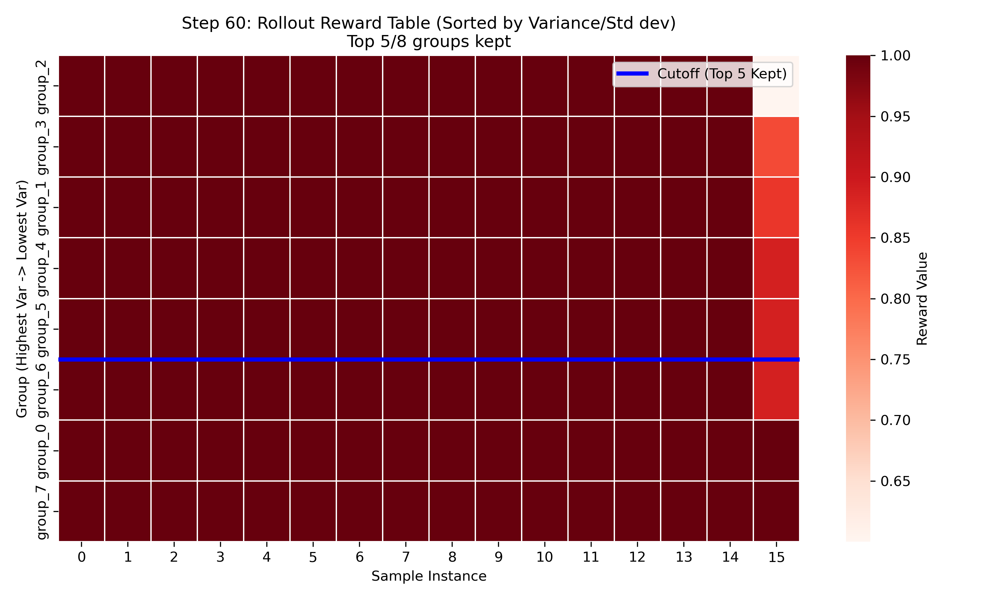
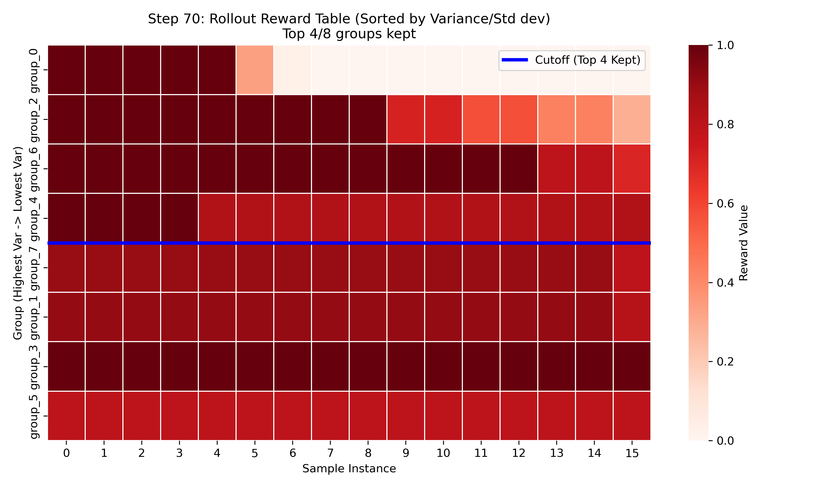
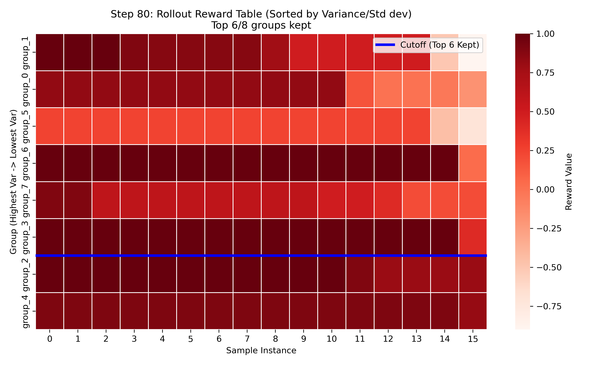
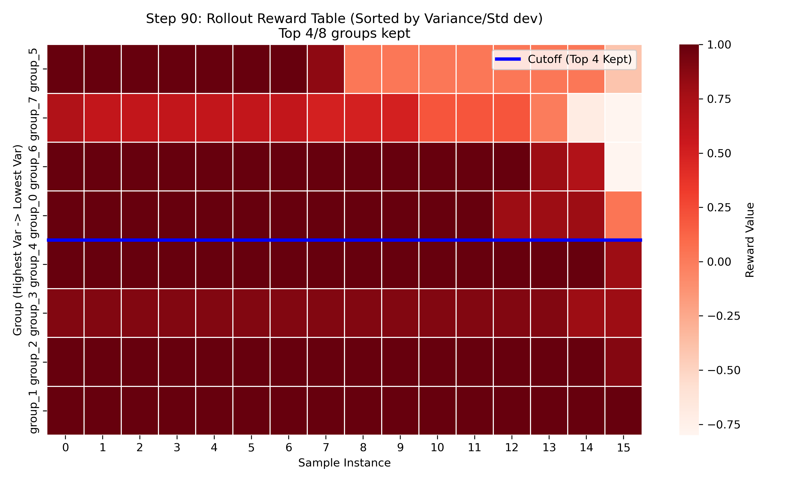

# Reward Heatmap Visualization (Progression)

To better understand the variance and selection across groups during training progression, the carousel below visualizes the individual rollout rewards for **Steps 0, 10, 20... up to 90** across all 8 groups for the `Qwen2.5-3B-Instruct` linear top-p run.

- **The Y-axis** represents the Groups, sorted downwards from Highest Standard Deviation to Lowest Standard Deviation.
- **The X-axis** represents the individual sample instances within each group, sorted left to right (highest to lowest reward).
- **The Intensity (Red)** indicates the raw Reward value.
- **The Blue Line** separates the "Kept" groups (top) from the "Dropped" groups (bottom) based on the linear `0.9` top-p threshold evaluated using standard deviations.

*Note: If viewing on GitHub, scroll down to see the images sequentially. If viewing in an editor that supports the `carousel` markdown extension, you can click through them interactively.*

````carousel

<!-- slide -->

<!-- slide -->

<!-- slide -->

<!-- slide -->

<!-- slide -->

<!-- slide -->

<!-- slide -->

<!-- slide -->

<!-- slide -->

````
